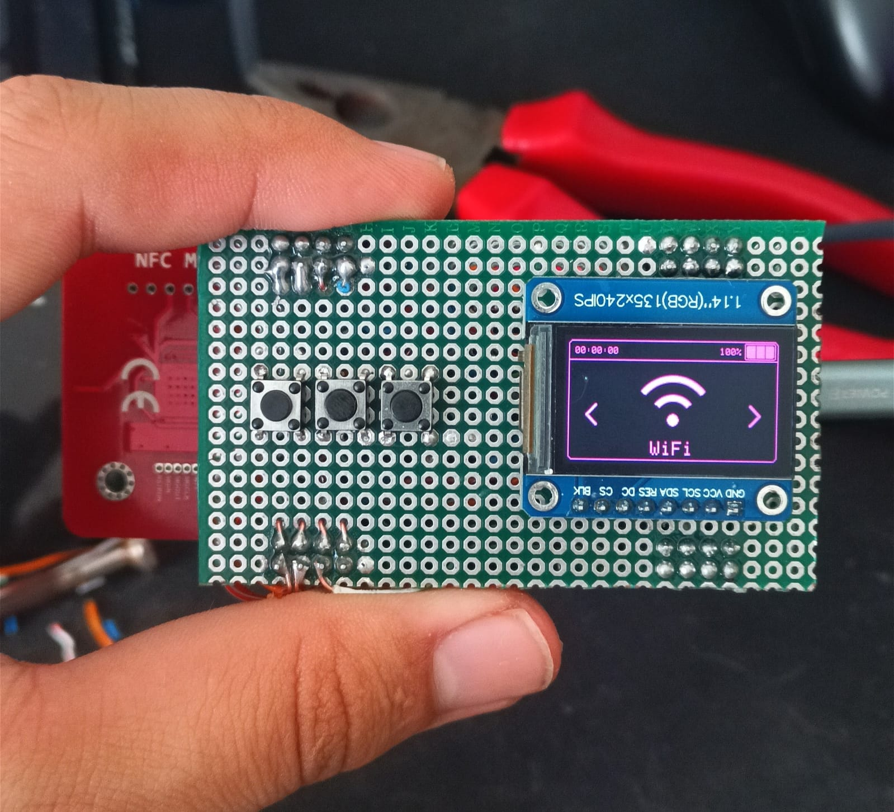

# Bruce Mini DIY 🚀

Selamlar! İlk DIY projem olan Bruce Mini DIY projesi, NodeMCU-ESP32, ESP32-WROOM, ESP32-U(TAVSİYE EDİLİR) gibi modellerde çalışabilir.
ekran olarak 1.14 İnç ST7789V2 kullanıldı. NRF24, PN532, CC1101 modülleri takılabilir. Bruce yazılımında bulunan tüm özellikler bu DIY Projesinde
bulunmaktadır.

### 📷 Cihaz Görselleri

Aşağıda, montajı tamamlanmış ve stabil çalışan Bruce Mini DIY cihazına ait görsel yer almaktadır:

